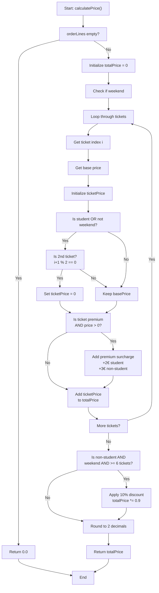

# Path Testing Analysis for Cinema Booking System - calculatePrice()

## Control Flow Diagram

## Path Identification

Using **Node Coverage (C0)** and **Edge Coverage (C1)**, we identify the following independent paths:

### Path 1: Empty Order
- **Entry:** Empty orderLines
- **Nodes covered:** A → B → C → V
- **Condition:** `orderLines.isEmpty() == true`
- **Result:** Returns 0.0

### Path 2: Single Standard Ticket, Non-Student, Weekday
- **Entry:** 1 standard ticket, non-student, weekday
- **Nodes covered:** A → B → D → E → F → G → H → I → J → M → N → P → Q → R → T → U → V
- **Conditions:** `isStudent=false`, `isWeekend=false`, `isPremium=false`, `i+1 % 2 != 0`
- **Result:** Full price charged

### Path 3: Two Standard Tickets, Student Order (2nd Free)
- **Entry:** 2 standard tickets, student order
- **Nodes covered:** Path 2 + K (2nd ticket free logic)
- **Conditions:** `isStudent=true`, `i+1 % 2 == 0`
- **Result:** 1st full price + 2nd free

### Path 4: Single Premium Ticket, Non-Student, Weekday
- **Entry:** 1 premium ticket, non-student, weekday
- **Nodes covered:** A → B → D → E → F → G → H → I → J → M → N → O → P → Q → R → T → U → V
- **Conditions:** `isPremium=true`, `ticketPrice > 0`, `isStudent=false`
- **Result:** Base price + €3 premium surcharge

### Path 5: Two Tickets, Non-Student, Weekend (< 6 tickets)
- **Entry:** 2 tickets, non-student, weekend
- **Nodes covered:** Full loop without 10% discount
- **Conditions:** `isStudent=false`, `isWeekend=true`, `ticketCount < 6`
- **Result:** Normal prices, no group discount

### Path 6: Six Premium Tickets, Non-Student, Weekend (10% Discount)
- **Entry:** 6 premium tickets, non-student, weekend
- **Nodes covered:** All paths including S (10% discount)
- **Conditions:** `isStudent=false`, `isWeekend=true`, `ticketCount >= 6`, `isPremium=true`
- **Result:** Full price + premiums with 10% group discount applied

### Path 7: Mixed Tickets (2nd free + Premium)
- **Entry:** 2 tickets (1 standard, 1 premium), student order
- **Nodes covered:** K + O (free ticket doesn't get premium charge)
- **Conditions:** 1st standard + 2nd premium (which becomes free)
- **Result:** 1st full price, 2nd free (no premium surcharge on free ticket)

## Test Cases Summary

| # | Scenario | Student | Weekday | Tickets | Premium | Expected Result |
|---|----------|---------|---------|---------|---------|-----------------|
| 1 | Empty order | - | - | 0 | - | €0.00 |
| 2 | Single standard | No | Yes | 1 std | No | €10.00 |
| 3 | Two standard (2nd free) | Yes | Yes | 2 std | No | €10.00 |
| 4 | Single premium | No | Yes | 1 prem | Yes | €13.00 |
| 5 | Two weekend tickets | No | No | 2 std | No | €24.00 |
| 6 | Six premium (10% discount) | No | No | 6 prem | Yes | €85.50 |
| 7 | Two mixed (std+prem, 2nd free) | Yes | Yes | 1 std + 1 prem | Mixed | €10.00 |

## Cyclomatic Complexity

**M = E - N + 2P**
- E (edges) = 18
- N (nodes) = 15
- P (connected components) = 1
- **M = 18 - 15 + 2(1) = 5**

This indicates moderate complexity, well within acceptable ranges (typical threshold is 10).

## Coverage Metrics Target

- **Line Coverage:** > 95%
- **Branch Coverage:** > 90%
- **Path Coverage:** 7 independent paths identified and tested
